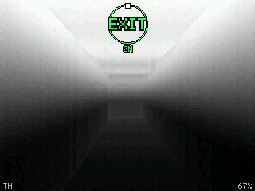
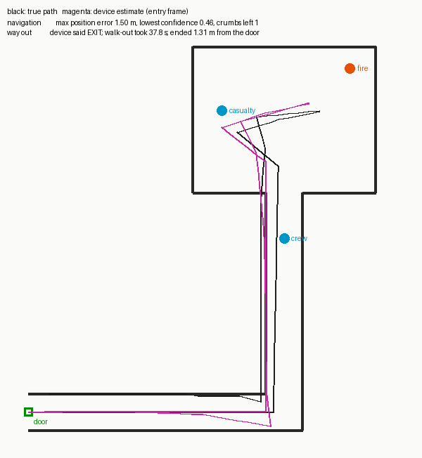

# PyroSight

Software for a firefighter thermal eyepiece: FLIR Lepton 3.5 thermal camera,
ESP32-P4 running the AI detector, Bosch BNO085 motion sensor for finding the
way back out, a 0.39" micro-OLED at the eye and audio prompts through a 3.5 mm
jack. Standalone: no WiFi, no Bluetooth, no internet.



## What is here

| Folder | What | Status |
|---|---|---|
| `core/` | All algorithms in portable C99: thermal pipeline, detection helpers, distance, navigation, alerts, display compositor, power policy, system integration | Done; 5 unit-test suites pass |
| `firmware/` | ESP-IDF project for the ESP32-P4: Lepton VoSPI + CCI, BNO085 SH-2, ESP-DL detector, MIPI-DSI micro-OLED, ES8311 audio, buttons, battery | Written; protocol code passes 6 host test suites. **Not yet compiled against ESP-IDF or run on hardware** (see firmware/README.md "Known gaps") |
| `ml/` | Synthetic thermal data, CenterNet-style detector, training, smoke-sliced evaluation, ONNX export, ESP-DL int8 `.espdl` export | Runs end to end; 110 tests pass. **Weights are trained on synthetic data only** |
| `sim/` | Host simulator: ray-cast smoke-filled building, simulated BNO085, a simulated firefighter who searches and then walks out following only the arrow | Done |
| `tools/` | Step/turn calibration per wearer, audio clip generator, partition flashing | Done |
| `docs/` | `ARCHITECTURE.md`, `TEST_PLAN.md` | |

## Run it without hardware

```sh
cmake -S . -B build && cmake --build build
(cd build && ctest)                                  # core unit tests
make -C firmware/test_host                           # firmware protocol tests
./build/sim/ps_sim --scenario corridor --out run/    # one simulated search and exit
python3 sim/render_report.py run/                    # run/eyepiece.gif, run/track.png
python3 sim/monte_carlo.py --seeds 20                # navigation bench, all scenarios
python3 -m pytest ml/tests -q                        # ML pipeline tests (needs torch)
```

## How each design step is covered

| Design step | Where | Notes |
|---|---|---|
| 1. Thermal pipeline | `core/src/ps_thermal.c`, `firmware/components/lepton` | 160x120 at 8.7 fps, low-gain radiometric (fire temps measurable), motion-adaptive temporal filter + 3x3 median, scene window that ignores fire pixels, detail enhancement |
| 2. AI model | `ml/` | 286k params, ~55M MACs (estimate). Synthetic held-out mAP@0.5 0.77; on the C simulator's scenes (never trained on) 0.66, person AP 0.53. Per-channel int8 costs ~0.002 mAP |
| 3. ESP32-P4 firmware | `firmware/` | inference once per new frame within a 62 ms budget, boxes for fire and people, distance from body size, automatic fallback to a threshold detector |
| 4. Motion and navigation | `core/src/ps_nav.c`, `firmware/components/bno085` | steps + gyro heading, turn detection, breadcrumb trail with loop pruning, crawl handling, confidence relative to the way out |
| 5. Display | `core/src/ps_display.c`, `firmware/components/microoled` | thermal + boxes + arrow + status, outlined HUD, white-hot / iron / amber night palettes, brightness levels |
| 6. Audio | `core/src/ps_alerts.c`, `firmware/components/audio` | "Way out is behind you, to the left" when confidence drops; "Navigation estimate unreliable. Follow the hose line out." below the floor |
| 7. Integration and power | `core/src/ps_system.c`, `firmware/main` | one mutex-guarded system object, health supervisor, battery low/critical modes that slow work but never switch it off |
| 8. Testing | `docs/TEST_PLAN.md` | automated tests and simulator bench, plus smoke-chamber and training-building procedures with pass criteria |

## Simulator results (20 seeds per scenario)

| scenario | out by arrow | out by hose after "unreliable" warning | lost |
|---|---|---|---|
| corridor, 36 m route | 19/20 | 1/20 | 0/20 |
| long search with heavy drift | 0/20 | 20/20 | 0/20 |
| crawling for 15 m | 0/20 | 20/20 | 0/20 |
| camera + IMU dropouts | 0/20 | 20/20 | 0/20 |



## Before this goes near a real fire

1. **Real training data.** The model has only seen synthetic scenes. Record the
   actual Lepton 3.5 in low-gain radiometric mode at live-fire training burns
   and in a smoke chamber, with people in turnout gear at measured distances,
   label it, and fine-tune (`ml/README.md`, "Getting real weights").
2. **Bring-up on hardware.** Compile with ESP-IDF 5.3/5.4, confirm the four
   Lepton command IDs marked `[check]`, fill in the micro-OLED panel init table
   from its datasheet, and confirm the ESP-DL loader and tensor layout.
3. **Calibrate each wearer** with `tools/calibrate_steps.py`.
4. **Run the test plan**, especially the navigation course tests. The device is
   designed to say "follow the hose" when it is unsure; it is an aid to, not a
   replacement for, hose lines and search ropes.

Known improvement: the model input is `code/255`, which int8 quantises at
2^-7 and so keeps 128 of the 256 temperature codes (~0.84 C per step).
Feeding `(code-128)/128` would be exact; it needs a matching change in
`ml/`, the firmware detector and a retrain.
